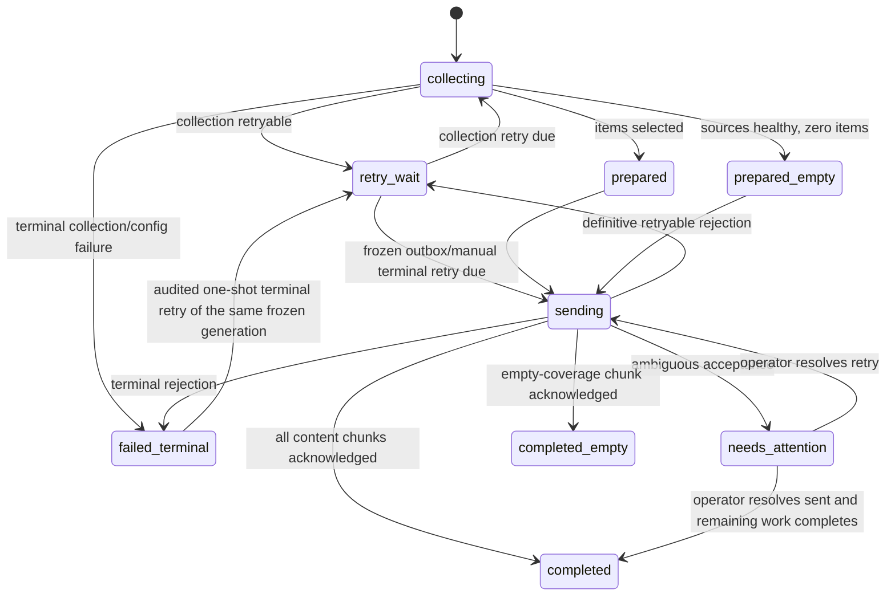

# MECO News Scraper — Production Readiness Implementation Plan

Status: **Rebaselined after implementation audit — mandatory gates remain open**  
Repository snapshot reviewed: 24-file original baseline plus the implemented unversioned directory snapshot  
Prepared from: repository-wide production and security audit  
Primary objective: move the current prototype to a safe, observable, recoverable, reproducible, and supportable production service  
Current release decision: **NO-GO until the mandatory gates in this plan and the linked closure plan pass**

Controlling closure backlog: [`PRODUCTION_READINESS_CLOSURE_IMPLEMENTATION_PLAN.md`](PRODUCTION_READINESS_CLOSURE_IMPLEMENTATION_PLAN.md)  
Last implementation verification: **2026-08-24**

---

## Implementation-audit rebaseline — 2026-08-24

The implementation was checked against this plan after the repository was reported complete. The result is **partially implemented, not production-ready**. This rebaseline does not discard or weaken any original requirement. It prevents implemented files, passing smoke tests, or the presence of documentation from being mistaken for acceptance evidence.

Verified local facts at rebaseline:

- 23/23 collected tests passed, Ruff 0.9.10 check and format checks passed, mypy 1.15 strict mode passed, and wheel/sdist builds passed;
- combined line-and-branch coverage was 59%, below the mandatory 90% repository gate and without the required critical-branch proof;
- Compose syntax, PowerShell parsing, and the existing shallow build-context sentinel passed;
- Docker daemon/runtime validation, target-host validation, external monitoring, release controls, and rollout evidence were unavailable or absent;
- the directory had no usable Git provenance, protected branch, review history, tag, or immutable release record;
- focused adversarial and state-machine probes reproduced release-blocking defects in schema preflight, health truthfulness, forced generations, lease authorization, delivery ambiguity, hostile Unicode/XML handling, SSRF classification, migration compatibility, restore safety, scheduler behavior, observability, packaging, and release evidence.

Wave status is therefore reset as follows:

| Original wave | Rebaseline status | Reason it remains open |
|---|---|---|
| Wave 0 | Open | No authoritative VCS/CI history; D1–D12 are not recorded as approved decisions. |
| Wave 1 | Open — partial code only | CLI mode isolation, validation-before-side-effects, exact schema compatibility, and truthful preflight are not proven and have reproduced failures. |
| Wave 2 | Open — partial code only | Lease ownership is not enforced on every mutation; force generation, migration compatibility, legacy-writer exclusion, and restore invariants fail. |
| Wave 3 | Open — partial code only | Telegram ambiguity classification, bounded retry time, outbox recovery proof, scheduler outcome handling, and config reload are incomplete. |
| Wave 4 | Open — partial code only | Identity is source-dependent and deduplication is not fully deterministic, publisher-aware, or bounded/accounted as specified. |
| Wave 5 | Open — partial code only | Unicode scalar isolation, encoding-independent XML defenses, multicast blocking, hard deadlines, egress defense, and real image-context proof are incomplete. |
| Wave 6 | Open — partial code only | Health can be falsely green; stdout logging, redaction, metrics, alerts, restore drills, retention, and target-host validation are incomplete. |
| Wave 7 | Open — partial code only | CI depth, transitive locking, supported-Python consistency, license decision, SBOM, provenance, signing, and immutable release automation are absent or incomplete. |
| Wave 8 | Open — no acceptance evidence | Shadow, canary, rollback rehearsal, controlled cutover, and the 72-hour observation record have not occurred. |

The linked closure plan is now the execution ledger for bringing the implemented code back into conformance. It maps every rebaseline finding to a closure task, owner, failing test, review loop, gate, and evidence artifact. This document remains the architectural and acceptance contract. If the documents appear to conflict, the stricter safety invariant applies until the coordinator records an explicit amendment in both documents.

No original wave, gate, or Definition of Done checkbox may be marked complete solely because a corresponding file or test exists. Completion requires the closure-plan evidence and an independent review.

---

## 1. How to use this plan

This document is the implementation contract for the production-readiness effort. It is intentionally more specific than a backlog:

- Goals define the production properties the system must acquire.
- Invariants define behavior that implementation choices may not weaken.
- Waves define dependency order.
- Task IDs provide stable units for issues, commits, pull requests, and agent assignments.
- Loops define how work is tested, reviewed, and repeated.
- Gates define objective completion; code being written is not completion.
- The traceability matrix maps every audit finding to a task and verification artifact.

The coordinator should keep this file current as decisions are made. A material design change must update the relevant goal, invariant, task, tests, and rollout notes in the same change.

Do not attempt the program as one large change. Use small integration units, keep the service runnable after every merged unit, and never combine a database migration, delivery-side-effect change, and deployment cutover into an unreviewable single step.

---

## 2. Executive outcome

> Rebaseline note: this section describes the original audited prototype. It is retained for provenance; current implementation status is recorded above and in the closure plan.

The current code has a healthy small-codebase foundation:

- all nine existing offline tests pass;
- the runtime is mostly standard-library Python;
- Telegram HTML fields are escaped;
- SQLite values use bound parameters;
- the container runs as a non-root user;
- configuration is mounted read-only in Compose;
- common source failures are already partly isolated.

It is not yet safe for unattended production because:

- daemon dry-run options can cause live delivery;
- Telegram chunks and database completion are not recoverably coordinated;
- concurrent processes can both send;
- failed deliveries do not retry the same day;
- stale direct-feed stories bypass the documented lookback;
- cross-run identity and in-run deduplication are inconsistent;
- hostile or malformed feeds can stall, exhaust, or abort the complete run;
- the deployment lacks reliable health, alerts, backup/restore, immutable release controls, and target-host validation.

The target is a single active scheduler backed by SQLite, with durable run ownership and an outbox. This plan does not turn SQLite into a multi-region high-availability datastore and does not claim mathematically exact-once Telegram delivery. It makes side effects resumable, records uncertainty explicitly, and prevents automatic replay when Telegram acceptance is unknown.

---

## 3. Production goals

### G0 — Safe control plane

No CLI option, configuration value, or startup path may trigger a live side effect when the operator requested validation or dry-run behavior.

Success measures:

- invalid option combinations exit with code 2 before opening writable state or initializing Telegram;
- dry-run is offline: it never performs remote network calls and never creates, migrates, writes, leases, sends, backs up, or schedules;
- configuration and secret validation happens before collection or state transition;
- the effective mode is logged in a redacted, machine-readable startup event.

### G1 — Delivery integrity and recoverability

Each delivery date has one active owner. Prepared content and Telegram chunks are immutable. Confirmed chunks are not automatically resent. Ambiguous sends stop and require reconciliation.

Success measures:

- 50 repeated two-process tests always produce one lease owner and one sender;
- a restart at every persistence/network boundary resumes without replaying a confirmed chunk;
- a timeout after possible request transmission becomes `ambiguous`, not an automatic retry;
- completed deliveries remain immutable;
- `--force` creates a new audited generation and never rewrites a completed generation.

### G2 — Resilient and bounded external-input processing

Every external source has explicit network, parsing, item, field, memory, CPU, and error-isolation budgets.

Success measures:

- one malicious, malformed, slow, or unavailable source cannot abort healthy sources;
- no response is read without a byte ceiling and absolute deadline;
- redirect and DNS policy prevents access to local/private/link-local destinations;
- parsing and deduplication have deterministic work ceilings;
- malformed items are quarantined individually with bounded, sanitized diagnostics.

### G3 — Correct content freshness and identity

All collectors obey one freshness policy, and delivery history distinguishes canonical URL identity from title similarity.

Success measures:

- no known-date article older than the configured window is selected;
- future-skew and missing-date policies are explicit and tested;
- identical canonical URLs are suppressed across runs;
- title-only suppression is time-bounded;
- deterministic deduplication output is independent of source completion order;
- zero-content and all-source-failure outcomes are distinct.

### G4 — Operable deployments

Operators can tell whether the service is healthy, what it last did, what it will do next, and how to recover it.

Success measures:

- every run has a run ID and exactly one terminal structured event;
- status reports lease, delivery, retry, ambiguity, last-attempt, and last-success state;
- overdue or failed delivery becomes unhealthy and alerts;
- Linux/NAS and Windows deployment procedures pass target-specific smoke tests;
- an online SQLite backup and restore drill meets the RPO/RTO targets.

### G5 — Reproducible and secure releases

Every production artifact is built from versioned source, pinned inputs, automated gates, and an auditable promotion process.

Success measures:

- source is under version control with a protected integration branch;
- wheel, source distribution, and container build reproducibly from locked dependencies;
- the production image is selected by immutable digest;
- CI passes unit, integration, fault, concurrency, migration, security, and deployment tests;
- no unwaived high/critical first-party, dependency, or image finding remains.

### G6 — Controlled rollout and support

The production cutover is staged, reversible, documented, and performed with one scheduler.

Success measures:

- shadow and canary phases pass before production chat delivery;
- pre-migration database backup is verified;
- rollback is rehearsed;
- runbooks cover delivery ambiguity, source outage, Telegram failure, corruption, disk exhaustion, backup/restore, secret rotation, and rollback.

---

## 4. Initial service-level objectives

These are proposed starting targets. Confirm them in Wave 0 and record any approved changes.

| Objective | Initial target | Evidence |
|---|---:|---|
| Delivery timeliness | Digest or explicit healthy `no_content` result by 07:15 WIB on 99% of scheduled days | Delivery/status history |
| Miss detection | No successful run for 26 hours triggers a critical alert | Health/alert test |
| Duplicate integrity | Zero automatically replayed confirmed chunks | Outbox history and recovery tests |
| Ambiguity visibility | Ambiguous delivery becomes unhealthy and visible within 5 minutes | Fault test and status output |
| Source isolation | One source failure never discards healthy-source results | Integration tests |
| Freshness | Zero selected known-date stories beyond `lookback_days` | Selection tests and run metrics |
| Recovery point objective | 24 hours or better | Backup schedule |
| Recovery time objective | 60 minutes or better | Restore drill |
| Security | No unwaived high/critical finding | CI/security report |
| Run observability | 100% of attempts have run ID, duration, outcome, and terminal event | Log contract tests |

---

## 5. Non-negotiable invariants

1. Only one process may own the active delivery lease.
2. Database transactions are never held open across network calls.
3. Prepared delivery items and rendered chunks are immutable.
4. A Telegram chunk with confirmed `ok=true` is never automatically resent.
5. A request whose acceptance is unknown is marked `ambiguous` and blocks later chunks.
6. Lease expiry does not prove that an in-flight Telegram request failed.
7. Completed deliveries are immutable; forced work creates a new generation.
8. Dry-run is offline: it performs no remote network call and no state, lease, migration, Telegram, log-file, status-file, backup, or scheduler mutation. Candidate evaluation, when requested, uses explicitly supplied frozen local input.
9. Every remote response and metadata field has a soft configurable limit and a non-disableable hard ceiling.
10. One source or item may degrade coverage but may not terminate healthy-source processing.
11. Only validated, normalized URLs and bounded fields reach ranking, persistence, or Telegram.
12. A successful empty-news day is distinct from an all-sources-failed day.
13. Schema migrations are forward-only, transactional where SQLite permits, checksummed, backed up, and tested from every supported prior state.
14. No binary lacking the current migration catalog, maintenance guard, and writer fence may write a migrated database; old and current binaries never write it concurrently.
15. Production secrets are runtime-only and never enter source control, build context, image layers, logs, status files, backup manifests, or error text.

---

## 6. Decisions to confirm in Wave 0

Implementation may proceed with the recommended defaults unless the owner records a different decision.

| ID | Decision | Recommended default |
|---|---|---|
| D1 | Authoritative VCS and CI host | Restore the real Git history/remote if it exists; otherwise initialize Git only after confirming this snapshot is authoritative. Examples in this plan assume GitHub Actions but do not require GitHub. |
| D2 | License, ownership, and release authority | Record the actual owner and license; do not invent metadata. Require one named release approver and one operational approver. |
| D3 | Supported deployments | Linux/NAS Compose and Windows Task Scheduler, each with a separate validated runbook. |
| D4 | Python versions | Support Python 3.12 and 3.13; use one pinned Python 3.13 patch release in production. |
| D5 | Runtime libraries | Use Pydantic 2 for typed configuration and HTTPX for streaming/timeouts unless a dependency review chooses equivalent maintained libraries. Lock every dependency. |
| D6 | Missing publication dates | Exclude by default in production; surface in dry-run with an exclusion reason. Permit a narrow configured exception only after business approval. |
| D7 | Title-only dedupe window | 14 days initially; canonical URL suppression remains long-lived. |
| D8 | Telegram ambiguity | Never auto-resend. Require an operator to resolve as `sent` or `retry`, with an audit record. |
| D9 | Zero-story policy | If at least one source succeeded, send one outboxed coverage notice and complete as `completed_empty`; if all sources failed, retry and alert. |
| D10 | Alert channel | Use a channel independent of the production Telegram delivery path where feasible. At minimum expose nonzero status/health for host monitoring. |
| D11 | SQLite storage | Local POSIX/NTFS storage only. SMB/NFS-hosted SQLite is unsupported until an explicit locking test profile passes. |
| D12 | Data retention | Keep article identity for at least 365 days, attempts for at least 90 days, and backups as 7 daily/4 weekly/12 monthly unless policy requires more. |

---

## 7. Target architecture

### 7.1 Runtime flow

```mermaid
flowchart LR
    A[CLI or scheduler] --> B[Typed config and offline preflight]
    B --> C[Acquire SQLite lease]
    C --> D[Bounded source collection]
    D --> E[Validate and quarantine items]
    E --> F[Freshness, ranking, deterministic dedupe]
    F --> G[Persist immutable delivery and outbox chunks]
    G --> H[Telegram sender]
    H --> I[Per-chunk acknowledged / retryable / terminal / ambiguous]
    I --> J[Delivery completion and article history]
    J --> K[Status, metrics, logs, alert state]
```



### 7.2 Delivery state model



Leases are orthogonal to delivery state. Reclaiming an expired lease is safe only after inspecting the durable delivery and chunk states.

The terminal-retry edge is not force and does not rebuild content. It is allowed only for an allowlisted retry-safe terminal reason, with no ambiguous/in-flight chunk, under exclusive operator authority. It appends an audit record, preserves acknowledged chunks and prior attempts, and grants a separately bounded one-shot retry authorization. Any content or destination change requires a separate approved design path and may not mutate the failed generation.

### 7.3 Chunk state model

```text
pending -> in_flight -> sent
                    ├─> retry_wait -> pending   # explicit retry-safe rejection
                    ├─> failed_terminal         # explicit permanent rejection
                    └─> ambiguous               # transmission/acceptance unknown
failed_terminal -> retry_wait -> pending        # audited one-shot retry of this exact frozen chunk
```

An audited terminal retry atomically targets one failed chunk and its delivery. Previously sent chunks remain sent; later pending chunks remain blocked until the retried chunk is acknowledged. The authorization is consumed when that exact chunk re-enters `in_flight`; another terminal/ambiguous outcome requires new reconciliation and is never replayed automatically.

### 7.4 Target SQLite state model

The concrete schema version is assigned by the approved immutable migration catalog; “v2” is no longer an authoritative version label. Names may change during design review, but the represented facts may not be lost. Migration, maintenance-fence, legacy-writer, downstream-field, and restore mechanics are superseded by Closure Tasks C2.1–C2.5 where those tasks are stricter.

| Table | Required purpose |
|---|---|
| `schema_migrations` | Applied version, checksum, timestamp, application version |
| `maintenance_state` | Maintenance epoch/fence and exclusive-operation audit used with the process-lifetime execution guard |
| `run_leases` | Scope, owner UUID, acquisition, heartbeat, expiry, fence |
| `deliveries` | Delivery date, generation, predecessor/force audit, kind, state, config/destination hashes, retry clock/budget fields, timestamps, terminal error |
| `delivery_attempts` | Immutable attempt number, start/end, outcome, sanitized error class/text, manual authorization where applicable |
| `delivery_items` | Frozen ordered item snapshot, canonical URL key, title key, metadata, chunk mapping |
| `outbox_chunks` | Frozen HTML, payload hash, destination/send-option snapshot reference, state, attempt count, in-flight time, Telegram message ID, error |
| `article_history` | URL key, versioned title keys, delivery/chunk, sent/publication timestamps |
| `source_results` | Source outcome, bytes, duration, accepted/quarantined counts, stable reason code |

Enable `PRAGMA foreign_keys=ON`, WAL, an explicit busy timeout, UTC timestamps, and short transaction contexts. Do not rely on a row existing as proof that its state transition was valid; transition methods must use conditional updates and verify affected-row counts.

---

## 8. Multi-agent operating model

The active environment supports four concurrent slots including the coordinator. Use at most three worker agents simultaneously.

### 8.1 Roles

#### Coordinator / integration owner

Responsibilities:

- owns this plan, cross-cutting decisions, sequencing, and final integration;
- assigns narrow task packets with dependencies, owned files, and gates;
- prevents simultaneous edits to overlapping files in a shared workspace;
- reviews evidence rather than accepting self-reported completion;
- runs full-suite and repository-level verification;
- owns `app.py` integration unless explicitly delegated for one wave;
- is the only role allowed to mark a wave complete.

#### Agent A — Delivery and state

Primary scope:

- schema, migrations, backup/restore;
- leases, attempts, immutable generations;
- outbox chunks and ambiguity handling;
- scheduler recovery and retry state;
- storage, concurrency, migration, and fault tests.

Likely owned files:

- `meco_news/storage.py`
- new `meco_news/state.py`
- new `meco_news/migrations.py`
- migration resources
- new delivery/recovery/concurrency tests

#### Agent B — Ingestion and security

Primary scope:

- HTTP streaming, redirect policy, SSRF controls;
- URL validation and item quarantine;
- XML/JSON limits and source isolation;
- freshness, bounded deduplication, trusted-domain attribution;
- adversarial parser/network tests.

Likely owned files:

- `meco_news/collectors.py`
- `meco_news/ranking.py`
- new `meco_news/network.py`
- new `meco_news/urls.py`
- ingestion/security tests

#### Agent C — Configuration, operations, and release

Primary scope:

- typed configuration and preflight;
- structured logs, status, health, metrics, alerts;
- package metadata, locks, CI, Docker, Windows scripts;
- deployment, backup, release, and incident documentation.

Likely owned files:

- `meco_news/config.py`
- new `meco_news/preflight.py`
- new `meco_news/observability.py`
- `Dockerfile`, `compose.yaml`, scripts, CI, and docs

#### Rotating independent reviewer

After a worker finishes, a different worker becomes reviewer for that packet. The reviewer:

- reads the diff and acceptance tests;
- attempts to falsify the claimed invariant;
- checks failure/rollback paths;
- returns findings only and does not silently rewrite the implementation;
- may implement review fixes only through a new explicitly assigned packet.

### 8.2 Shared-workspace rules

1. Prefer isolated Git worktrees once the repository history is restored.
2. If agents share one filesystem, assign disjoint files and serialize edits to `app.py`, `models.py`, configuration, and shared tests.
3. Every packet lists allowed files and forbidden overlapping files.
4. A worker must inspect current contents immediately before patching because another completed packet may have changed them.
5. Do not use destructive Git commands. Preserve unrelated work.
6. Do not run public-network integration tests; use local fakes.
7. Database fixtures and generated artifacts belong in temporary directories, never in `data/`.
8. A worker cannot approve its own migration, security boundary, or release gate.

### 8.3 Required task-packet format

Every agent assignment must include:

```text
Task ID and goal
Dependencies and baseline commit
Owned files
Explicit out-of-scope items
Required failing tests first
Implementation constraints/invariants
Acceptance commands
Artifacts/evidence to return
Rollback or migration risk
```

### 8.4 Required handoff format

```text
Outcome
Files changed
Behavior before/after
Tests added and commands run
Failure paths exercised
Known limitations/open questions
Migration/rollback notes
Recommended reviewer focus
```

---

## 9. Recurring implementation loops

These loops are part of the work, not optional process overhead.

### L1 — Red/green/review implementation loop

For every defect or invariant:

1. Reproduce it with a deterministic failing test.
2. Record the intended state transition or contract.
3. Implement the smallest coherent change.
4. Run focused tests.
5. Run all offline tests.
6. Have another agent review the diff and try a counterexample.
7. Address review findings.
8. Rerun quality, security, and repository hash/status checks.
9. Merge only when the task acceptance gate passes.

Exit condition: implementation, regression test, documentation, and rollback note are present.

### L2 — Crash and ambiguity loop

For every delivery or database transition:

1. Stop the process immediately before the transition.
2. Stop it after the local commit but before the external call.
3. Stop it after request transmission but before response handling.
4. Stop it after external acknowledgment but before local acknowledgment.
5. Restart.
6. Verify the resulting state is pending, retryable, sent, ambiguous, or terminal as designed.
7. Verify no confirmed chunk is resent and no ambiguous chunk is auto-retried.

Exit condition: every boundary has a fault-injection test and deterministic recovery result.

### L3 — Hostile-input security loop

For every network/parser/formatter boundary:

1. Define the attacker-controlled input and hard budget.
2. Add a fixture at the limit and one beyond it.
3. Add malformed type, encoding, URL, redirect, and structure variants.
4. Confirm only the source/item is quarantined.
5. Confirm logs and persisted errors contain no raw secret or unbounded payload.
6. Measure elapsed work and memory for the maximum accepted corpus.
7. Re-run the repository security scan after the remediation wave.

Exit condition: deterministic fail-closed behavior with bounded resource use and no high/critical finding.

### L4 — Content-quality loop

1. Run old and new selection logic against frozen representative fixtures.
2. Compare selected, excluded, deduplicated, and stale items with reason codes.
3. Review unexpected deltas with the business owner.
4. Tune configuration, never hard-code one fixture outcome.
5. Re-run permutation/property tests.
6. Shadow production sources without sending for several days.

Exit condition: freshness and identity invariants pass without unacceptable loss of useful coverage.

### L5 — Deployment and recovery loop

For each supported platform:

1. Build/install from clean, locked inputs.
2. Run offline preflight.
3. Start as the documented nonprivileged identity.
4. Verify writable state, read-only configuration/root filesystem, health, logs, and signal handling.
5. Inject dependency failure and confirm retry/health/alert behavior.
6. Create a backup.
7. Corrupt a disposable copy and restore.
8. Roll back to the previous pinned artifact and compatible database.

Exit condition: deployment and rollback runbooks are executable by someone other than the implementer.

### L6 — Release feedback loop

1. Merge through protected CI.
2. Build artifacts once.
3. Promote the same digest through shadow, canary, and production.
4. Observe SLOs and resource budgets.
5. Record incidents and tuning changes.
6. Feed production evidence back into fixtures, tests, thresholds, and runbooks.

Exit condition: the release remains within SLOs through the defined observation window.

---

## 10. Dependency-ordered roadmap

### Wave 0 — Control the baseline and finalize contracts

Goal: make later evidence attributable and eliminate unresolved product semantics.

Owners: coordinator, with Agent C supporting repository/release setup.  
Dependencies: none.  
Production deployment allowed after this wave: no.
Audit status (2026-08-24): **OPEN** — provenance and owner decisions are not evidenced.

#### W0.1 — Restore version-control provenance

Actions:

- determine whether this snapshot came from an existing Git remote/history;
- restore that history rather than manufacturing a new one where possible;
- if this is the authoritative source, initialize Git, commit the untouched baseline, and record its checksum;
- choose the CI provider and protected integration branch;
- record code owner/release approver rules;
- create an issue for every task ID in this plan.

Gate:

- every later change is reviewable as a diff from the audited baseline;
- unrelated changes cannot silently enter the production-readiness program.

#### W0.2 — Freeze the executable baseline

Record and automate:

- supported Python versions;
- `python -B -m unittest discover -s tests -v`;
- module-import smoke test;
- watchlist validation;
- PowerShell parse checks;
- `docker compose config --no-env-resolution --quiet`;
- current selection fixtures and database fixtures;
- no-public-network CI rule.

Gate:

- baseline commands and outputs are stored in CI or a checked-in developer guide;
- tests do not create repository bytecode/cache/state artifacts.

#### W0.3 — Approve behavior decisions

Resolve D1–D12. In particular, approve:

- Telegram ambiguity policy;
- `--force` meaning;
- zero-story behavior;
- missing-date behavior;
- dedupe retention;
- alert channel;
- deployment targets and storage constraints.

Gate:

- no state-machine implementation begins with an unresolved side-effect policy.

---

### Wave 1 — Safe CLI, typed configuration, and preflight

Goal: prevent unsafe mode dispatch and reject invalid deployment state before side effects.

Primary owner: Agent C.  
Reviewer: Agent A.  
Dependencies: Wave 0 decisions.  
Production deployment allowed after this wave: no.
Audit status (2026-08-24): **OPEN** — partial implementation has reproduced CLI/preflight false-success and startup-side-effect defects.

#### W1.1 — CLI mode contract

Likely files:

- `meco_news/app.py`
- new `tests/test_app.py`
- `README.md`

Required behavior:

- create a typed `RunOptions` or command-mode object;
- reject `--daemon --dry-run`;
- reject `--daemon --force`;
- reject `--run-now` without daemon;
- reject `--top-candidates` without dry-run and with daemon;
- make `--test-telegram`, `--discover-chat`, status, preflight, backup, and delivery modes mutually exclusive;
- perform option validation before writable state, migration, collection, or Telegram initialization;
- reserve explicit commands for retry and ambiguous-delivery resolution;
- make dry-run an offline mode using explicitly supplied frozen local candidate input; it never performs DNS/HTTP/Telegram calls;
- make dry-run use existing history read-only when present;
- add `--ignore-history` for intentional all-candidate previews.

Acceptance:

- a parameterized option matrix passes;
- mocks prove invalid/dry-run modes make no network or writable-state calls;
- dry-run leaves database, WAL, status, logs, and timestamps unchanged.

#### W1.2 — Typed configuration

Recommended model:

- `AppConfig`
- `RuntimeSettings`
- `FeedConfig`
- `GoogleNewsConfig`
- `GdeltConfig`
- `TopicConfig`
- `CollectionLimits`
- `NetworkPolicy`
- `RetryPolicy`

Validation:

- forbid unknown keys;
- validate types and nested shapes;
- require unique source/query/topic IDs;
- validate `HH:MM` and a real IANA timezone;
- bound daily counts, scoring thresholds, lookback, future skew, retries, timeouts, response bytes, entries, fields, source count, and query length;
- require HTTPS feed URLs and an explicit redirect/origin policy;
- validate score relationships and nonempty configured sources;
- support deterministic timezone data on Windows;
- reject placeholder Telegram values for live modes;
- redact configuration output.

Recommended initial soft limits:

| Limit | Default |
|---|---:|
| Response bytes/source | 5 MiB |
| Source wall-clock deadline | 35 seconds |
| Socket inactivity timeout | 5 seconds |
| Redirect hops | 2 |
| Entries/source | 250 |
| XML depth | 32 |
| XML nodes | 10,000 |
| Title | 512 characters |
| Summary | 2,048 characters |
| Source label | 160 characters |
| URL | 2,048 characters |
| Fuzzy candidates | 500 |
| Fuzzy comparisons | 20,000 |

Configuration may lower these. Increases may not exceed reviewed hard ceilings.

#### W1.3 — Offline and optional online preflight

Add commands equivalent to:

```text
meco-news preflight [--json] [--online]
meco-news config-show --redacted
```

Offline checks:

- configuration and timezone;
- secret presence and placeholder detection without printing secrets;
- state directory existence, permissions, free space, SQLite/WAL capability;
- schema compatibility/migration requirement;
- current lease/state;
- supported Python/application version.

Online checks, only when explicitly requested:

- Telegram `getMe`;
- narrowly bounded source reachability.

Suggested exit codes:

| Code | Meaning |
|---:|---|
| 0 | ready |
| 2 | CLI/configuration |
| 3 | secret |
| 4 | state filesystem |
| 5 | schema/migration |
| 6 | active lease/contention |
| 7 | online dependency |

Wave 1 gate:

- no production module consumes the application configuration as an unchecked `dict[str, Any]`;
- invalid combinations/configuration fail before side effects;
- preflight and redacted config output pass token-canary tests;
- existing configuration migrates or validates deterministically.

---

### Wave 2 — Versioned persistence, leases, and immutable delivery state

Goal: establish the durable correctness boundary before adding retries.

Primary owner: Agent A.  
Reviewer: Agent C for migration/backup and Agent B for stored untrusted fields.  
Dependencies: Wave 1 configuration contracts.  
Production deployment allowed after this wave: no.
Audit status (2026-08-24): **OPEN** — ownership, generation, migration, legacy-writer, and restore invariants are not satisfied.

#### W2.1 — Migration framework and backup-before-migrate

Actions:

- add `schema_migrations(version, checksum, applied_at, app_version)`;
- inspect and adopt the exact legacy schema as migration 0001;
- define every migration from immutable canonical resources whose historical checksum cannot change when a later migration is added;
- add forward-only migrations for attempts, leases, maintenance fencing, delivery items, destination snapshots, chunks, URL/title identity, retry elapsed/clock fields, force audit fields, source results, and status;
- verify legacy column layouts before stamping;
- use `sqlite3.Connection.backup()` for a consistent pre-migration backup;
- emit checksum, schema version, timestamp, application version, and redacted config digest;
- expose migration only through an explicit audited maintenance command;
- implement an exclusive process-lifetime maintenance/execution guard plus a transaction-visible maintenance fence;
- block legacy INSERT/UPDATE/DELETE paths after migration;
- run `PRAGMA integrity_check` before and after;
- ensure failed migrations roll back or leave a clearly recoverable state.

Legacy conversion:

- treat existing `sent_articles.fingerprint` as `title_key`;
- calculate canonical `url_key` from stored URLs;
- convert completed legacy runs to generation 0 completed deliveries;
- convert failed/running rows to explicit legacy outcomes;
- never automatically resend legacy failed/running content.

Acceptance:

- fresh, current legacy, and every supported intermediate fixture migrate;
- rerunning migrations is a no-op;
- interruption and rerun tests pass;
- every catalog-incompatible or legacy binary is blocked from writing the migrated state;
- restore of the pre-migration backup returns byte/logically equivalent v1 data.

#### W2.2 — Transactional state API

Replace broad `start_run/complete_run/fail_run` behavior with conditional transition methods.

Requirements:

- every transition uses a short transaction;
- every runtime transition requires a live owner capability and verifies the maintenance fence in that same transaction;
- every operator transition requires the exclusive maintenance capability and an audit record;
- invalid transitions affect zero rows and raise a typed state error;
- failure logging occurs only after rollback of the failed operation;
- attempts are immutable;
- completion and forced work never overwrite prior terminal history;
- original bounded item metadata is stored only in the frozen delivery snapshot;
- article history records only acknowledged chunks/items.

Acceptance:

- failure after each SQL statement/commit boundary cannot commit unintended partial state;
- forced failure cannot change the completed state of an earlier generation;
- all transition methods have branch-complete state tests.

#### W2.3 — Atomic run lease

Lease fields:

- scope;
- owner UUID;
- acquired, heartbeat, and expiry timestamps.

Requirements:

- acquire via conditional insert/update under an immediate write transaction;
- second process returns `already_running` without collecting or sending;
- only the owner may heartbeat, transition, or release;
- every owner heartbeat/transition also verifies that no maintenance fence superseded the process;
- heartbeat during collection and delivery;
- conservative TTL plus monotonic in-process scheduling;
- recovery inspects chunk state before reclaiming.

Recovery:

- expired during collection with no outbox: safe to restart collection;
- expired with pending/retry-wait chunks: resume them;
- expired with `in_flight`: convert to `ambiguous`;
- expired with sent chunks: do not replay them.

Acceptance:

- 50 repeated real two-process tests yield one owner;
- owner mismatch and stale-heartbeat tests pass;
- process termination at every lease stage recovers as specified.

#### W2.4 — Immutable generations and force semantics

Requirements:

- normal run resumes the current incomplete generation or skips a completed date;
- `--force` is allowed only after completion and with no active/ambiguous generation;
- force creates generation N+1;
- force still excludes prior sent history unless an explicit audited replay command is used;
- manual resolution requires delivery/chunk ID, reason, operator identity, and timestamp.
- terminal retry reopens the same frozen failed generation to `retry_wait` only for an allowlisted retry-safe reason, with no ambiguous/in-flight chunk, and grants a bounded audited one-shot attempt without resetting automatic retry history;

Wave 2 gate:

- migration, backup, state transitions, leases, and immutable generation tests all pass;
- no network call occurs inside a database transaction;
- no catalog-incompatible or legacy process remains capable of writing the migrated database;
- a rollback rehearsal using a disposable database succeeds.
- preflight/schema truth tables are rerun against the post-migration structural signature;
- any later schema change reopens the migration fixture/fault gate and the applicable preflight gate.

---

### Wave 3 — Durable outbox, Telegram ambiguity, retries, and scheduler recovery

Goal: make external delivery restart-safe and failures operationally visible.

Primary owner: Agent A.  
Telegram/message reviewer: Agent B.  
Operations reviewer: Agent C.  
Dependencies: Wave 2 state model.  
Production deployment allowed after this wave: no; the rebaselined implementation must also pass successor Closure Gates CG0–CG6 before canary.
Audit status (2026-08-24): **OPEN** — canary is not allowed until ambiguity, retry-budget, outbox, and scheduler closure gates pass.

#### W3.1 — Freeze delivery batches and chunks

Order:

1. Acquire lease.
2. Collect/select while heartbeating, outside long database transactions.
3. Atomically store delivery, ordered items, rendered chunks, payload hashes, item-to-chunk map, configuration hash, and delivery date.
4. Retry/restart using the stored payload, never regenerated content.

Rendering must use the frozen delivery date/config snapshot, not current time on retry.

Acceptance:

- payload bytes and hashes remain identical across restart, midnight, and config changes;
- no prepared item changes after persistence;
- item history can be tied to the exact acknowledged chunk.

#### W3.2 — Per-chunk send protocol

Before the request:

- transactionally mark the chunk `in_flight`;
- create an immutable attempt record;
- commit.

After the request:

- `accepted`: persist Telegram message ID and mark `sent`;
- `rejected_retryable`: persist retry state and next attempt;
- `rejected_terminal`: persist terminal error;
- `ambiguous`: persist ambiguity, stop later chunks, mark delivery `needs_attention`.

Never automatically resend ambiguous chunks. Include a deterministic delivery/chunk ID in visible output to aid human reconciliation, while acknowledging that it is not an API idempotency key.

Acceptance:

- confirmed chunk is never replayed;
- later chunks do not send after ambiguity;
- article history contains acknowledged items even if a later chunk fails;
- manual `resolve sent` and `resolve retry` paths are audited and tested.

#### W3.3 — Safe retry classification

Safe examples:

- explicit Telegram 429 with bounded `retry_after`;
- selected explicit 5xx responses if the client proves the request was rejected before acceptance;
- collector GET failures that are idempotent and non-ambiguous.

Ambiguous examples:

- read timeout/reset after request transmission;
- process death while chunk is `in_flight`;
- malformed response after possible acceptance.

Use capped exponential backoff, jitter, per-host concurrency limits, and durable `next_attempt_at`.

Acceptance:

- retry deadlines survive restart;
- retry exhaustion becomes terminal/alerting;
- a runtime kill switch can disable automatic retries;
- no retry loop can exceed configured attempts or total elapsed budget.

#### W3.4 — Scheduler recovery

Requirements:

- startup recovers due/incomplete work before planning a new delivery;
- daemon wakes at the earlier of next delivery or durable retry;
- run failure is not ignored;
- same-day retry remains associated with the frozen delivery date;
- host clock and timezone changes do not duplicate dates;
- configuration reload behavior is explicit: validate on each cycle and record a config hash.

Windows should run `run-if-due` every 10–15 minutes rather than relying on host-local 07:00. The application computes the WIB due window and lease/state makes repeated invocation safe.

#### W3.5 — Zero-story and all-source-failure outcomes

Introduce a structured `CollectionResult` with per-source outcome/count/duration.

Policy:

- at least one source succeeded, zero eligible stories: outbox one coverage notice and complete `completed_empty` after acknowledgment;
- all sources failed: retry; never mark a healthy empty day;
- 1–4 stories: deliver with degraded coverage warning;
- retry exhaustion after all-source failure: terminal alert and unhealthy status;
- rerunning completed empty date does not send another notice;
- offline dry-run displays the policy outcome only from explicitly supplied frozen local input and never invokes source or Telegram network clients.

Wave 3 gate:

- fault injection passes before/after every chunk transition;
- confirmed, retryable, terminal, and ambiguous paths are distinguishable;
- same-day durable retry and empty/outage policies pass;
- local recording/fake-sink multi-chunk restart drill produces no duplicate confirmed chunk; real canary evidence is reserved for Closure Task C7.2.

---

### Wave 4 — Freshness, identity, deterministic deduplication, and message correctness

Goal: make business output consistent with the documented intelligence policy.

Primary owner: Agent B.  
History/state reviewer: Agent A.  
Dependencies: Wave 2 article history; Wave 3 frozen delivery model for final message/state mapping.  
Production deployment allowed after this wave: no; the rebaselined implementation must also pass successor Closure Gates CG0–CG6 before shadow/canary.
Audit status (2026-08-24): **OPEN** — shadow/canary is not allowed until identity, ordering, bounded-work, and rendering properties pass.

#### W4.1 — Central freshness policy

Apply one UTC cutoff after collection and before ranking for all collectors.

Requirements:

- known date older than `lookback_days`: exclude;
- date beyond future-skew tolerance: exclude or quarantine;
- missing date: apply D6 policy;
- record exclusion reason counts;
- Google/GDELT request filters are hints, not the enforcement boundary.

Acceptance:

- exact cutoff boundary, old direct RSS, future, missing, and timezone cases pass;
- no old story can be restored by fallback score.

#### W4.2 — Dual cross-run identity

Rules:

- canonical URL match: suppress for the retention period;
- normalized title match: suppress only within `title_dedupe_days`;
- fuzzy similarity: current prepared batch only;
- title keys are indexed but not globally unique.

Migration and state:

- backfill URL keys;
- keep title and URL evidence separately;
- record why an item was excluded.

Acceptance:

- same URL/revised title suppresses;
- same title/different URL suppresses inside and is allowed outside the window;
- tracking-parameter and query-order normalization tests pass.

#### W4.3 — Deterministic in-run deduplication

Stages:

1. group canonical URLs;
2. merge exact titles;
3. rank/remove non-topical or below-fallback candidates;
4. fuzzy cluster within bounded buckets.

Merge metadata field-by-field:

- preserve direct publisher URL over aggregator URL;
- allow a richer summary to augment without replacing identity;
- bind trusted-domain scoring to a validated hostname, not arbitrary RSS `<source url>`;
- remove stale parallel-index bookkeeping.

Acceptance:

- all input permutations produce identical items/order;
- stale-index reproducer no longer discards a distinct article;
- direct URL is never replaced solely because an aggregator has a summary;
- fuzzy comparison count stays within budget.

#### W4.4 — Telegram message invariants

Requirements:

- bound every field before rendering;
- measure conservative final Telegram units, including astral Unicode;
- retain a target such as 3,900 UTF-16 units under the 4,096 limit;
- apply a separate raw HTML byte limit;
- compact oversized blocks in a fixed order: omit summary, shorten source, shorten title, quarantine if still impossible;
- validate every final message immediately before `send_html`;
- build result identifies delivered and omitted items;
- omitted items are not stored as sent;
- coverage note becomes its own chunk if needed;
- timezone label derives from the actual configured timezone, not hard-coded `WIB`.

Wave 4 gate:

- frozen-fixture and production-sample content comparison is approved by the business owner; durable shadow evidence is reserved for Closure Task C7.1;
- stale/future/identity/permutation tests pass;
- every final message-size property test passes;
- no selected maliciously oversized item prevents healthy-item delivery.

---

### Wave 5 — Harden network, parsers, URLs, and source isolation

Goal: close all five validated security findings with defense in depth.

Primary owner: Agent B.  
Reviewer: Agent C for deployment egress and Agent A for bounded persistence.  
Dependencies: Wave 1 limits/config; can proceed in parallel with parts of Waves 2–4 where files do not overlap.  
Production deployment allowed after this wave: no; the rebaselined implementation also requires the successor security, platform, and release gates.
Audit status (2026-08-24): **OPEN** — adversarial Unicode/XML/URL/deadline cases and deployment egress remain unresolved; no closing rescan exists.

#### W5.1 — Central URL validation and item quarantine

Add separate URL policies for:

- feed-fetch URLs;
- article URLs rendered to Telegram;
- optional provenance URLs.

Validated URL result should include normalized URL, scheme, hostname, display hostname, and port.

Reject:

- nonstring/oversized/control-containing values;
- missing host;
- userinfo;
- invalid ports;
- malformed IPv6 brackets;
- invalid IDNA/NFKC authority;
- non-HTTP(S) article schemes;
- private/link-local IP literals.

Behavior:

- invalid article URL quarantines only that item;
- invalid optional provenance URL is cleared without granting trusted-domain score;
- ranking consumes validated host fields and never reparses raw metadata;
- raw rejected URL is not persisted or logged.

#### W5.2 — Redirect SSRF and egress control

Requirements:

- disable automatic redirects;
- process each redirect explicitly;
- require HTTPS and disallow downgrade;
- same-host redirect by default;
- cross-host only through exact configured allowlist;
- validate scheme, host, port, userinfo, hop count, and every resolved A/AAAA answer;
- reject any loopback, private, link-local, multicast, unspecified, reserved, or non-global answer;
- strip sensitive headers;
- log normalized host and reason code, not raw query/Location;
- add host/orchestrator egress policy that independently denies private/link-local targets.

Important limitation:

Application DNS checks do not completely solve DNS rebinding. Deployment egress control is a required second boundary.

#### W5.3 — Bounded streaming and parsing

Network:

- stream response in bounded chunks;
- reject excessive `Content-Length`, but always count actual bytes;
- enforce inactivity timeout and monotonic absolute deadline;
- terminate or isolate jobs so executor shutdown cannot wait indefinitely;
- cap redirects and retries.

XML:

- reject DTD/entity declarations;
- use an incremental parser;
- enforce byte, depth, node, text, and entry limits during parsing;
- clear processed elements;
- keep repair behavior only inside the same byte/work budgets.

JSON:

- require top-level object and bounded articles list;
- require bounded expected field types;
- cap articles and strings independently of server request parameters.

Persistence:

- only bounded normalized fields enter `NewsItem` and SQLite.

#### W5.4 — Complete per-source exception isolation

Introduce stable result/error types:

- `SourceResult`
- `SourceDataError`
- stable quarantine/failure reason codes.

Contain expected boundary failures including:

- `http.client.HTTPException`/`IncompleteRead`;
- HTTP/URL/socket/timeout failures;
- Unicode decode failures;
- redirect/URL-policy failures;
- XML/JSON parse failures;
- schema/type failures.

Add a final per-source `except Exception` that:

- isolates unexpected source-local failures;
- emits a stack trace and high-severity operational signal;
- re-raises `MemoryError`;
- never catches `BaseException`;
- sanitizes and caps error text.

The whole run fails only for process-fatal conditions or when policy determines all sources unusable.

#### W5.5 — Bound fuzzy work and final Telegram output

Requirements:

- exact URL/title dedupe first in linear time;
- filter/rank before fuzzy work;
- inverted token buckets;
- per-item and global comparison limits;
- maximum string lengths;
- metric when budget is exhausted;
- retain best unmatched items instead of continuing indefinitely;
- final Telegram size assertion before send.

#### W5.6 — Docker build-context secret hygiene

Add `.dockerignore` covering:

```text
.git
.env
.env.*
!.env.example
data/
*.db
*.db-*
logs/
__pycache__/
*.py[cod]
.pytest_cache/
.venv/
venv/
dist/
```

Keep narrow explicit `COPY` statements. Add a CI sentinel test proving:

- `.env`, state, logs, caches, and VCS data are absent from build context;
- the sentinel is absent from final image layers/history;
- required source/config is present.

Wave 5 gate:

- adversarial URL, redirect, byte, deadline, XML, JSON, exception, dedup, and Telegram fixtures pass offline;
- no unbounded response read or automatic redirect remains;
- one bad source/item cannot abort healthy delivery;
- security rescan reports no unwaived high/critical finding and all five original findings are verified fixed.

---

### Wave 6 — Observability, backup/restore, and platform deployments

Goal: make the service diagnosable, recoverable, and safe on each supported host.

Primary owner: Agent C.  
State reviewer: Agent A.  
Security reviewer: Agent B.  
Dependencies: Waves 2–5 state/error contracts.  
Production deployment allowed after this wave: no; Wave 6 alone only prepares evidence for later target and release validation.
Audit status (2026-08-24): **OPEN** — false-green health, observability, recovery, retention, and platform proof block staged rollout.

#### W6.1 — Structured logs

Required fields:

- timestamp, level, event, version;
- run ID, delivery date, generation, attempt, chunk, lease owner;
- source ID;
- duration, counts, retry number;
- stable outcome and error class.

Requirements:

- JSON to stdout;
- optional rotating JSONL file for Windows;
- sanitize controls and bidirectional text;
- redact tokens, authorization, URL credentials, query strings, and payloads;
- exactly one terminal event per attempt;
- unexpected source-internal errors retain stack traces without raw response data.

#### W6.2 — Status, health, and metrics

Add commands equivalent to:

```text
meco-news status --json
meco-news healthcheck --max-heartbeat-age 180 --json
```

Status includes:

- current lease/run/generation/chunk;
- unresolved ambiguity;
- next retry;
- last attempt;
- last successful run;
- last successful delivery;
- next due time;
- schema/app version;
- last sanitized error class.

Daemon heartbeat at least every 60 seconds, including while waiting.

Minimum metrics:

- run totals by outcome;
- last attempt/success/delivery timestamps;
- run duration;
- source request/item/failure/quarantine counts;
- redirect/SSRF rejections;
- response bytes and deadlines;
- dedup comparisons/budget exhaustion;
- Telegram chunk outcomes;
- DB errors and lease state.

Health must fail for:

- active maintenance/exclusive execution guard;
- stale heartbeat;
- overdue delivery;
- terminal/ambiguous unresolved delivery;
- migration/schema incompatibility;
- corrupt/unwritable state.

#### W6.3 — Backup, retention, and restore tooling

Add a portable backup command using SQLite online backup.

Artifacts:

- consistent database;
- SHA-256;
- schema and application version;
- timestamp;
- redacted configuration hash/manifest.

Restore:

1. Stop schedulers and acquire the exclusive process-lifetime maintenance guard; refuse active leases or in-flight chunks.
2. Verify checksum, manifest, application/schema/source compatibility, and integrity.
3. Preserve the current target as a separately verified manifested artifact.
4. Restore to a temporary path and handle WAL/SHM consistently.
5. Verify/apply only supported migrations on the temporary copy.
6. Run integrity and the owner-aware non-public `maintenance_verify` routine on the temporary copy; normal preflight must remain non-ready while maintenance is active.
7. Atomically replace state and restore ownership/mode/ACL.
8. Run post-swap integrity and `maintenance_verify`; automatically restore the preserved target before releasing maintenance if either fails.
9. Keep scheduling disabled, release maintenance, require normal offline preflight exit 0, and automatically restore under reacquired maintenance if that final check fails.
10. Re-enabling exactly one scheduler is an explicit later operator action.

Backups are owner-only, rotated, encrypted off-host where available, and tested by automated restore.

#### W6.4 — Linux/NAS container

Requirements:

- pinned exact Python patch image and digest;
- multi-stage wheel installation;
- root-owned read-only application;
- UID/GID 10001;
- only state directory writable;
- `umask 077`;
- read-only root filesystem;
- all capabilities dropped;
- no-new-privileges;
- `init: true`;
- PID/CPU/memory limits;
- `/tmp` tmpfs;
- offline healthcheck;
- clean SIGTERM within 30 seconds;
- amd64 and arm64 smoke tests.

Storage:

- use a named volume initialized with correct ownership, or explicitly create/chown bind state;
- verify the directory, not just DB file, is writable for WAL/SHM;
- reject unsupported network filesystem deployment;
- config read-only and secrets runtime-only.

#### W6.5 — Windows scheduler

Requirements:

- explicit virtual-environment interpreter, not PATH discovery;
- dedicated non-admin service account;
- explicit ACLs for app/config/state/logs/secrets;
- run whether user is logged on or not;
- no highest privileges;
- invoke `run-if-due` every 10–15 minutes;
- application computes WIB due date;
- `MultipleInstances=IgnoreNew` as defense in depth;
- database lease remains authoritative;
- StartWhenAvailable;
- three restart attempts at 15-minute intervals;
- execution limit;
- durable logs and exit codes;
- installer/uninstaller idempotent;
- uninstall preserves secrets, database, logs, and backups.

#### W6.6 — Alerts and runbooks

Initial alerts:

- critical: no successful run for 26 hours;
- critical: corruption/migration failure/all sources failed after retries;
- high: Telegram terminal/ambiguous failure;
- warning: more than half of sources fail for two runs;
- warning: heartbeat older than 3 minutes while daemon should run;
- warning: less than 1 GiB or 10% state disk free.

Wave 6 gate:

- platform smoke tests pass under documented identities;
- health and alerts change correctly in injected failures;
- backup/restore meets RPO/RTO;
- a different operator can execute runbooks without author assistance.

---

### Wave 7 — Packaging, CI, supply chain, and release automation

Goal: make production artifacts reproducible and guarded.

Primary owner: Agent C.  
Reviewers: Agents A and B for their critical paths.  
Dependencies: stable runtime/dependency choices from earlier waves.  
Production deployment allowed after this wave: no; a signed build-once candidate is eligible only for the gated Wave 8 rollout after all successor pre-rollout gates pass.
Audit status (2026-08-24): **OPEN** — there is no protected source or attestable release pipeline, so production deployment remains prohibited.

#### W7.1 — Python package

Add `pyproject.toml` with:

- actual ownership/license metadata;
- supported Python versions;
- console entry point `meco-news = "meco_news.app:main"`;
- runtime dependencies;
- development/test groups;
- Ruff, type checker, pytest, and coverage settings;
- one canonical version source.

Add a committed lockfile. Build wheel and source distribution. Container installs the wheel, not a loose source tree.

Acceptance:

- clean locked install;
- wheel-only CLI smoke;
- wheel/sdist metadata check;
- version matches CLI, image label, changelog, and release tag.

#### W7.2 — Test suites

Required layers:

- unit/property;
- local fake HTTP/Telegram integration;
- state/migration/backup;
- multi-process concurrency;
- fault/kill-point;
- security regression;
- Windows/PowerShell;
- installed package;
- container/platform smoke.

Coverage target:

- at least 90% line and branch overall;
- 100% branch for the full critical-decision set in Closure Tasks C4.7/C6.1, including CLI/configuration, migration/lease/force/outbox/retry/health/redaction, Unicode, URL/DNS/redirect, XML/parser/MemoryError, worker cleanup, identity/merge/fuzzy budgets, and Telegram omission/size policy.

Coverage is a backstop, not a replacement for invariant/fault tests.

#### W7.3 — CI matrix

| Job | Platform/runtime | Mandatory checks |
|---|---|---|
| Static quality | Ubuntu, Python 3.13 | Ruff format/check, strict type checking, Bandit or equivalent |
| Unit | Ubuntu, Python 3.12/3.13 | Unit/property and coverage |
| Unit | Windows, Python 3.12/3.13 | Unit, timezone, filesystem behavior |
| Integration/fault | Ubuntu, Python 3.13 | Fake HTTP/Telegram, kill points, resource limits |
| Concurrency/migration | Ubuntu and Windows, Python 3.13 | Leases, legacy upgrades, backup/restore |
| PowerShell | Windows | Parser, PSScriptAnalyzer, Pester |
| Package | Ubuntu | Wheel/sdist build, install, CLI smoke |
| Container | Buildx amd64/arm64 | Nonroot, read-only, state, health, signal smoke |
| Security | Ubuntu | Dependency audit, secret scan, static scan, image/filesystem scan |
| Release | Protected signed tag | SBOM, provenance, signature, checksums |

All CI tests run without public network except an explicitly controlled dependency-fetch/build phase using locked inputs.

#### W7.4 — Merge/release gates

- zero lint/type/test/package/Pester failures;
- required coverage;
- two-process test yields one sender in 50 repetitions;
- migration/backup/restore round trip preserves fixture data;
- every final Telegram payload satisfies limits;
- adversarial corpus stays within reviewed CPU/memory/time budgets;
- actual context, every image layer/history entry, filesystem, metadata, and runtime are canary-clean for the exact candidate digest;
- no unwaived high/critical finding;
- third-party CI actions pinned to immutable commit SHAs;
- release artifact/image signed and accompanied by SBOM/provenance/checksums.

Wave 7 gate:

- a protected tag builds one candidate while its actual context is captured;
- that exact digest passes layer/history/runtime checks, SBOM/scans/provenance, and only then is signed without rebuilding;
- the same signed image digest is promotable to shadow, canary, controlled production observation, and production-ready;
- release and rollback documents name exact artifact/database compatibility.

---

### Wave 8 — Shadow, canary, rollback rehearsal, controlled production observation, and feedback

Goal: deploy without surprising the production chat or losing rollback.

Primary owner: coordinator/release approver.  
Supporting agents: all, for evidence review only.  
Dependencies: all mandatory prior gates.

Audit status (2026-08-24): **OPEN** — no shadow may start until CG6/RA-S; later phases require RA-C and RA-P as defined by the closure plan.

#### W8.1 — Shadow

- RA-S authorization from business, operations, security, and release approvers;
- separate database;
- production-like sources/configuration;
- no production Telegram send;
- 3–7 days;
- compare selections, stale exclusions, source failures, resource metrics, and due-time behavior;
- review with business owner.

Gate:

- no old/future item violation;
- no source aborts healthy collection;
- budgets are not routinely exhausted;
- content deltas approved.

#### W8.2 — Canary chat

- RA-C authorization after approved shadow evidence;
- separate bot/chat credentials;
- pinned release artifact;
- minimum three scheduled cycles;
- exercise one transient retry and one restart;
- exercise an ambiguous-send simulation with local fake before live canary;
- verify health/alerts/backups.

Gate:

- three on-time cycles;
- no duplicate confirmed chunk;
- no unresolved unexpected ambiguity;
- no secret leakage;
- successful backup and test restore;
- resource usage inside agreed host limits.

#### W8.3 — Rollback rehearsal and RA-P

1. Rehearse on a disposable production-like target before cutover.
2. Stop the scheduler/process and preserve current DB, logs, status, and evidence.
3. Time both compatible-binary and backup-required rollback paths where applicable.
4. Restore the verified prior database/artifact pair without replaying confirmed chunks.
5. Run offline preflight and recording-sink validation.
6. Reconcile every ambiguous/partial delivery before enabling one scheduler.
7. Verify health, state identity, artifact signature, and RTO.
8. Obtain RA-P from business, operations, security, and release approvers, binding exact digest, backup/restore receipt, rollback thresholds, change window, owners, and 72-hour plan.

#### W8.4 — Controlled production cutover and observation

1. Confirm RA-P is current and matches the candidate/target/config.
2. Disable every old scheduler/container and acquire the exclusive execution/maintenance guard.
3. Confirm no active process, lease, or in-flight chunk.
4. Create and verify the cutover backup.
5. Verify previous and candidate artifact/image digests, signatures, schema, and compatibility.
6. Deploy the exact signed candidate and run normal offline preflight before maintenance: require exit 0 for the current schema or the exact expected `migration_required` code for an approved prior schema; abort on any other result.
7. Acquire exclusive maintenance, migrate once only when required, and pass `maintenance_verify`; then release maintenance while scheduling remains disabled.
8. Require normal offline preflight exit 0 and validate post-migration status/health.
9. Set release state to `CONTROLLED_PRODUCTION_OBSERVATION` and enable exactly one scheduler.
10. Observe the first full production cycle in real time.
11. Maintain heightened alerts for a full 72 hours and roll back at an RA-P threshold.
12. Declare production-ready only after CG7 approval.

Never:

- roll back using a mutable tag;
- overwrite the only DB copy;
- run old and current binaries together;
- use `--force` while delivery state is unresolved.

Wave 8 gate:

- 72-hour observation passes;
- SLO and alert evidence is recorded;
- RA-S, RA-C, and RA-P evidence matches the exact release digest;
- CG7 formally marks the release production-ready.

---

## 11. Detailed test strategy

### 11.1 Unit and property tests

Cover:

- every CLI combination;
- every configuration boundary and unknown field;
- timezone availability and conversion;
- canonical URL normalization and title keys;
- redirect/address classification;
- malformed URL/IPv6/IDNA/port/control cases;
- freshness cutoff, future skew, missing-date policy;
- deterministic/permutation deduplication;
- message UTF-16/raw HTML limits and HTML escaping;
- state transition table;
- migration ordering/checksums;
- log redaction and sanitization;
- health-state transitions.

Use property testing for URL parsing, feed parsing, canonicalization, permutation independence, and message-size invariants.

### 11.2 Local integration tests

Use local fake servers; never public services.

HTTP/feed cases:

- RSS, Atom, Google-like RSS, GDELT-like JSON;
- relative and cross-host redirects;
- private/link-local/IPv6 destinations;
- 429/5xx;
- TLS/connect/DNS failures;
- incorrect Content-Length and `IncompleteRead`;
- invalid UTF-8;
- slow drip;
- oversized body/entries/fields;
- XML DTD/entity, nesting, node, and repair paths;
- wrong JSON shape/types.

Telegram cases:

- success with message ID;
- explicit 429/retry-after;
- terminal auth/content error;
- connect failure known not sent;
- read timeout/connection reset after possible transmission;
- malformed response;
- process death at each boundary;
- multi-chunk partial success;
- manual ambiguity resolution.

### 11.3 Fault and concurrency tests

Inject:

- read-only/missing state directory;
- disk full/low space;
- corrupt DB;
- process death during migration, backup, status replacement, collection, preparation, and every chunk transition;
- two concurrent one-shot invocations;
- daemon restart during retry wait;
- clock movement/timezone change;
- stale lease and owner mismatch;
- config changes after preparation;
- restart after midnight.

### 11.4 Security regression corpus

Include:

- SSRF redirects to loopback, RFC1918, link-local, metadata, IPv6, mapped addresses, mixed DNS answers;
- URL userinfo, invalid ports, control chars, Unicode confusables, malformed brackets;
- XML entity/DTD/amplification, deep nodes, large text, excessive items;
- JSON wrong types and large arrays/strings;
- worst-case near-matching headlines;
- HTML/entity/attribute/control/bidirectional text;
- huge source/URL/emoji message blocks;
- token canaries through exceptions, logs, status, DB, backups, build context, and image layers.

### 11.5 Target-host tests

Linux/NAS:

- state volume ownership and WAL;
- unsupported network filesystem rejection/documentation;
- nonroot/read-only/capability restrictions;
- signal shutdown;
- health transition;
- amd64/arm64.

Windows:

- venv interpreter;
- task principal/logged-out execution;
- ACLs;
- host timezone changes;
- IgnoreNew and database lease;
- retry settings;
- durable logs;
- idempotent install/uninstall.

---

## 12. Observability contract

### 12.1 Stable outcomes

At minimum:

- `completed`
- `completed_empty`
- `already_completed`
- `already_running`
- `retry_wait`
- `degraded`
- `failed_terminal`
- `needs_attention`
- `ambiguous`
- `preflight_failed`

Do not encode operational state only in free-text exceptions.

### 12.2 Stable reason codes

Examples:

- `response_too_large`
- `source_deadline_exceeded`
- `redirect_disallowed`
- `ssrf_address_class`
- `invalid_url`
- `invalid_encoding`
- `xml_depth_limit`
- `xml_node_limit`
- `entry_limit`
- `schema_invalid`
- `field_truncated`
- `dedup_budget_exhausted`
- `telegram_rate_limited`
- `telegram_terminal`
- `telegram_ambiguous`
- `db_locked`
- `db_corrupt`
- `state_unwritable`

### 12.3 Redaction rules

Never log or persist:

- Telegram token;
- authorization/cookie headers;
- URL userinfo or query strings unless explicitly allowlisted/redacted;
- raw response bodies;
- raw rejected URLs;
- unbounded attacker-controlled text;
- `.env` contents.

Error strings are sanitized, control-stripped, and capped before persistence.

---

## 13. Runbooks and documentation deliverables

Required:

- `docs/architecture.md`
- `docs/configuration.md`
- `docs/deployment-linux-nas.md`
- `docs/deployment-windows.md`
- `docs/monitoring.md`
- `docs/release.md`
- `docs/runbooks/no-delivery.md`
- `docs/runbooks/source-outage.md`
- `docs/runbooks/telegram-failure.md`
- `docs/runbooks/ambiguous-delivery.md`
- `docs/runbooks/database-corruption.md`
- `docs/runbooks/disk-full.md`
- `docs/runbooks/backup-restore.md`
- `docs/runbooks/rollback.md`
- `docs/runbooks/rotate-telegram-token.md`
- `SECURITY.md`
- `CHANGELOG.md`
- `CONTRIBUTING.md`

Each incident runbook includes:

- symptoms and alert name;
- safe diagnostic commands;
- decision tree;
- recovery commands;
- verification;
- rollback;
- escalation owner;
- evidence to preserve;
- actions that must not be taken.

README must match:

- zero-story versus all-source-failure behavior;
- real lookback enforcement;
- dry-run history behavior;
- configuration reload/restart behavior;
- Windows timezone/scheduler behavior;
- Docker volume ownership;
- exact delivery semantics, including ambiguity.

---

## 14. Audit traceability matrix

This matrix records the original audit. The implementation-audit delta and all newly reproduced defects are tracked in the successor closure plan's finding ledger. Both matrices are mandatory; a closure task does not erase its predecessor requirement.

| Audit finding | Plan task(s) | Required proof |
|---|---|---|
| Daemon dry-run can send live | W1.1 | CLI matrix and no-side-effect mocks |
| Partial Telegram sends replay | W3.1–W3.2 | Kill-point and multi-chunk recovery tests |
| Concurrent runs both send | W2.3 | 50-run two-process test |
| Failure waits until tomorrow | W3.3–W3.4 | Same-day durable retry/restart tests |
| Seven-day window not enforced | W4.1 | Direct-RSS cutoff tests |
| Linux/NAS state mount may be unwritable | W6.4 | Target volume/WAL smoke test |
| Cross-run identity uses title only | W4.2 | URL/title retention matrix |
| Source exceptions abort complete run | W5.4 | IncompleteRead/Unicode/schema isolation tests |
| Windows logs not durable | W6.1, W6.5 | Logged-out task and log test |
| Configuration validation shallow | W1.2–W1.3 | Boundary tests and preflight |
| Production control plane untested | W7.2–W7.3 | Integration/fault/concurrency CI |
| Zero stories fail silently | W3.5 | Empty/outage policy tests |
| Oversized block bypasses Telegram limit | W4.4, W5.5 | Property/adversarial message tests |
| Storage failure may commit partial state | W2.2 | Per-statement failure injection |
| Dedup replacement can discard articles | W4.3 | Stale-index and permutation tests |
| Windows scheduling uses host timezone | W3.4, W6.5 | Host timezone change test |
| Runtime packaging mutable/undeclared | W7.1, W7.3 | Locked wheel/image builds |
| Publication label hard-coded WIB | W4.4 | Alternate timezone render test |
| Config reload/uninstall rough edges | W3.4, W6.5, docs | Reload and idempotent uninstall tests |
| Redirect SSRF | W5.1–W5.2 | App and deployment egress tests |
| Unbounded feed resource use | W5.3, W5.5 | Byte/deadline/parser/CPU budgets |
| Malformed feed URL aborts ranking | W5.1, W5.4 | Per-item quarantine test |
| Build context may include `.env` | W5.6 | Sentinel context/layer test |

---

## 15. Risk register

| Risk | Impact | Mitigation/gate |
|---|---|---|
| Migration damages existing history | Duplicate or missing suppression | Online backup, fixture migrations, integrity checks, restore drill |
| Old and new processes overlap | Duplicate Telegram sends/corrupt state | Cutover freeze, lease, process check, one scheduler |
| Telegram ambiguity mishandled | Duplicate or omitted message | Explicit `ambiguous`, no auto-retry, manual audited resolution |
| Retry policy amplifies outage/rate limit | More failures or blocking | Caps, jitter, retry-after, kill switch, metrics |
| Security limits reject legitimate feeds | Coverage loss | Shadow comparison, per-reason metrics, narrow reviewed overrides |
| Redirect restrictions break provider changes | Source outage | Exact allowlist, controlled staging, source runbook |
| New dependencies add supply-chain risk | Vulnerabilities/reproducibility | Lockfile, audit, SBOM, pinning, review |
| Health threshold gives false alarm | Alert fatigue | Canary tuning and separate heartbeat/delivery signals |
| SQLite placed on unsupported network FS | Locking/corruption | Preflight/docs; local storage requirement |
| Shared-agent edits conflict | Lost or mixed changes | Worktrees or disjoint file ownership; coordinator integration |
| Dedup changes reduce useful volume | Business dissatisfaction | Frozen fixtures, shadow comparison, owner approval |
| Backups exist but cannot restore | Extended outage | Automated and manual restore drills |
| Secret reaches logs/build context | Credential compromise | Canaries, redaction tests, `.dockerignore`, image scan |

---

## 16. Suggested integration units

Keep each unit independently reviewable. Exact numbering may change, but dependency order should not.

1. Baseline VCS/CI decision and test harness.
2. CLI mode safety and no-side-effect dry-run tests.
3. Typed configuration and offline preflight.
4. Migration runner and backup/restore primitives.
5. Transactional attempts, immutable generations, and lease.
6. Frozen delivery/item/chunk schema and outbox.
7. Telegram classification, ambiguity, and recovery commands.
8. Durable retries, scheduler recovery, and zero/outage outcomes.
9. Freshness and dual URL/title identity.
10. Deterministic bounded deduplication.
11. Central URL validation and per-item quarantine.
12. Bounded HTTP/redirect/egress/parser/source isolation.
13. Telegram final-size enforcement and item omission mapping.
14. Structured logs, status, health, metrics, and alerts.
15. Linux/NAS deployment and Docker build-context hardening.
16. Windows scheduler hardening.
17. Package/lockfile/container/release pipeline.
18. Full fault/security/target-host CI gates and runbooks.
19. Shadow/canary/cutover and 72-hour observation.

Do not merge units 4–8 out of order. Do not enable retries before the outbox and ambiguity model exist.

---

## 17. Program definition of done

The repository is production-ready only when all of the following are true:

Rebaseline rule: every checkbox below remains open. It may be checked only after its linked Closure Gate has passed, the evidence manifest identifies immutable artifacts, and a reviewer other than the implementer has signed the review record.

### Correctness

- [ ] CLI dry-run and invalid modes cannot produce side effects.
- [ ] Freshness, identity, deduplication, zero-content, and all-source-failure behavior match documented policy.
- [ ] Every output is deterministic from its frozen inputs.

### Delivery integrity

- [ ] One active lease owner.
- [ ] Immutable delivery/items/chunks.
- [ ] Confirmed chunks never auto-replay.
- [ ] Ambiguous chunks block and require audited reconciliation.
- [ ] Force creates a generation without mutating prior completion.

### Reliability

- [ ] Same-day durable retries survive restart.
- [ ] Retry limits and exhaustion are visible.
- [ ] Backup/restore and rollback drills pass.
- [ ] Linux/NAS and Windows target-host tests pass.

### Security

- [ ] All original five security findings are verified fixed.
- [ ] Network/parser/message work is bounded.
- [ ] URL/redirect/egress policy fails closed.
- [ ] One bad source/item cannot abort healthy work.
- [ ] No unwaived high/critical finding.
- [ ] Secrets are absent from source, context, image, logs, state, and backups.

### Operations

- [ ] Structured terminal event for every attempt.
- [ ] Health detects stale/failed/ambiguous state.
- [ ] Alerts and runbooks are exercised.
- [ ] Operators can inspect and resolve state without manual SQL.

### Release

- [ ] Protected versioned source and review process.
- [ ] Locked package and immutable signed image.
- [ ] CI matrix and quality gates pass.
- [ ] Shadow and canary pass.
- [ ] Production cutover/rollback evidence recorded.
- [ ] 72-hour observation window passes.

Until an RA-P-authorized C7.4/W8.4 cutover begins, the supported posture is a supervised pilot in a non-production chat. From cutover through CG7, the only allowed production posture is `CONTROLLED_PRODUCTION_OBSERVATION` under the approved stop/rollback thresholds. Unattended production-ready operation is allowed only after every mandatory item and CG7 pass.

---

## 18. Rebaselined coordinator actions

1. Keep the release decision at **NO-GO** and prohibit production-chat credentials during implementation, tests, shadow work, and canary preparation.
2. Adopt `PRODUCTION_READINESS_CLOSURE_IMPLEMENTATION_PLAN.md` as the controlling implementation-audit backlog without closing any requirement in this predecessor plan.
3. Restore or initialize authoritative version control, preserve the 2026-08-24 audited snapshot, and record D1–D12 before any schema or release design is frozen.
4. Create one tracked item for each `F-###` finding and its `C#.#` closure task; link commits, reviews, tests, and evidence back to those stable IDs.
5. Dispatch at most three workers using the closure plan's disjoint ownership map. Require a deterministic red test or an explicit evidence-only protocol before implementation.
6. Execute Closure Waves C0–C7 in dependency order. Do not enable automatic retries before state ownership, immutable chunks, and ambiguity semantics pass CG2.
7. After every packet, run its focused loop, an independent adversarial review, and the applicable cumulative gate. Reopen the finding on any regression or unverifiable claim.
8. Permit shadow only after CG6 and RA-S, canary only after RA-C, and controlled production cutover only after rollback rehearsal and RA-P. During cutover/observation the release state is `CONTROLLED_PRODUCTION_OBSERVATION`; only CG7 may declare it production-ready. Every phase uses the exact immutable artifact that passed release verification.
